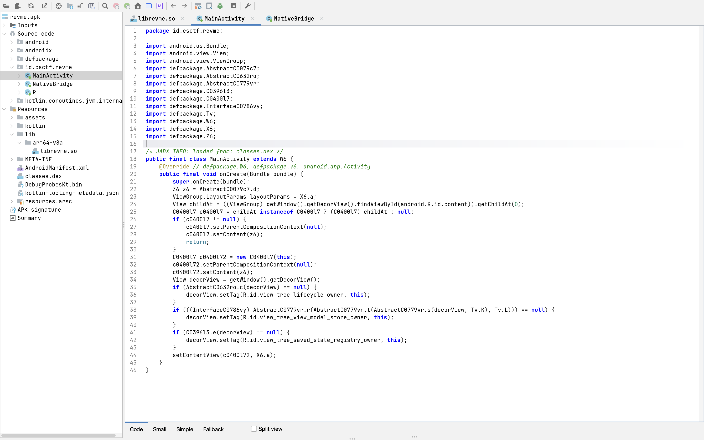
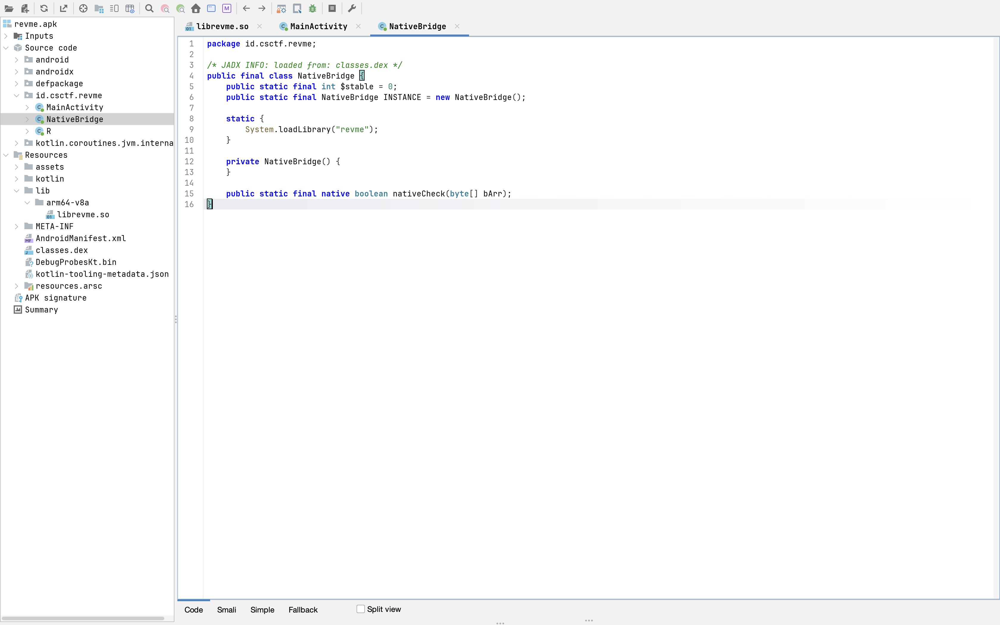
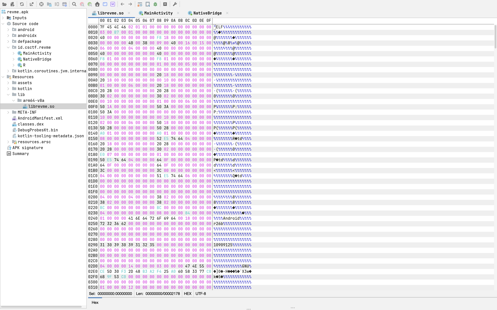
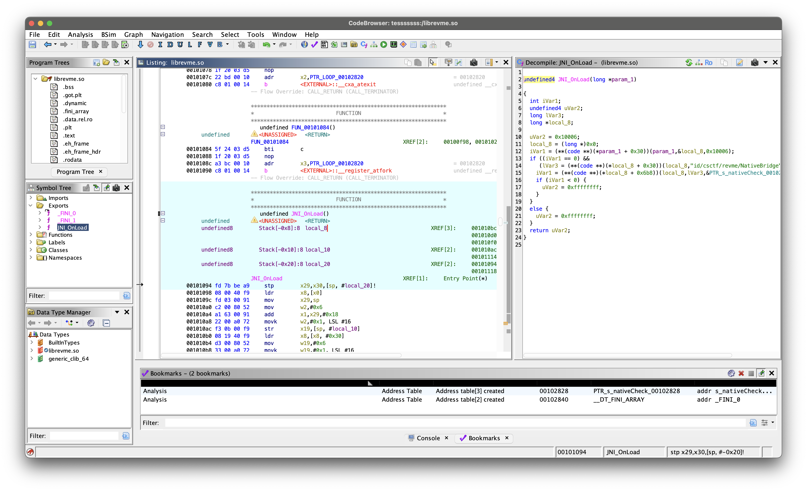
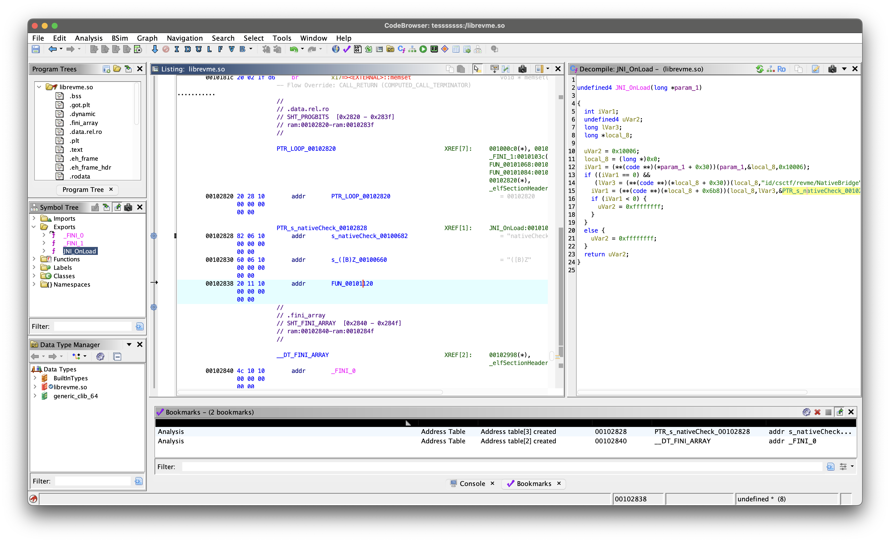
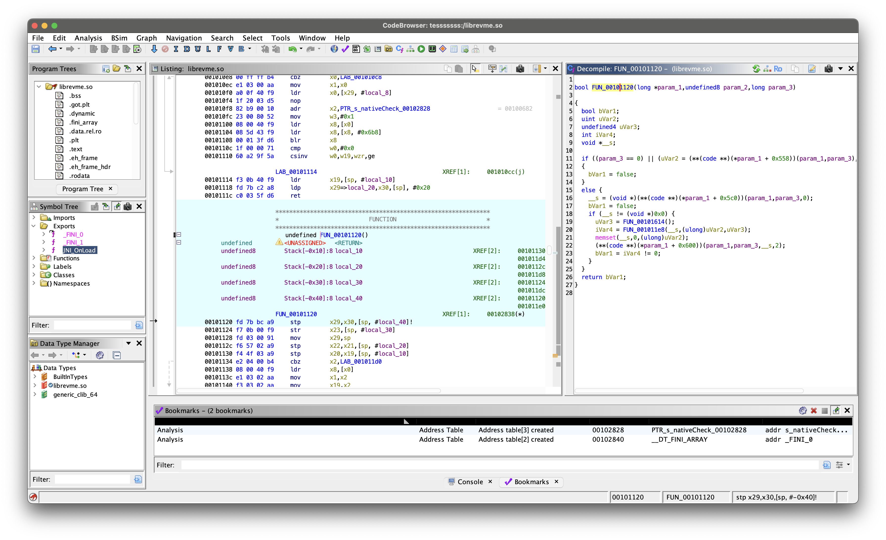

# Revme
## Tools

Dalam analisis ini, saya menggunakan beberapa *tools* berikut sesuai dengan kebutuhan di setiap fasenya:

* **Android Studio Emulator (AOSP API 33 ARM):** Lingkungan *sandbox* aman untuk mengeksekusi aplikasi.
* **JADX-GUI:** Untuk melakukan audit *source code* awal pada layer Java/Kotlin.
* **APKTool:** Untuk membongkar paket APK dan mengekstrak *binary* internal.
* **Ghidra:** *Framework reverse engineering* dari NSA untuk membedah *compiled binary*.
* **Frida:** Alat *dynamic instrumentation* untuk melakukan *hooking* dan manipulasi *runtime*.

## Step-by-Step
### Install aplikasi di emu
aplikasi hanya ada field untuk input flag, tidak ada button submit atau lainnya. kyknya emang harus ditrigger manual buat cek flagnya

### View source code pakai jadx gui

yaa emang ga ada apa2 disini.

tapi disini ada class NativeBridge

app ini sepertinya pakai native lib untuk cek flagnya


### Unpack app pakai apktool
unpack apk file pakai apktool dan ambil native librarynya (librevme.so)

### Static nalysis pake ghidra
native library ini sifatnya stripped, jadi tidak terlihat fungsi apa saja yang di export.

untuk awalan kita coba buka main functionnya yaitu JNI_OnLoad.

Disini memanggil nativeCheck, nama yang sama seperti di class wrapper yang ada di java.
Coba kita pergi ke address functionnya

disini function check memanggil 2 fungsi.
FUN_00101614 disini adalah antidebugger

FUN_001011e8 fungsi untuk check flag benar atau tidak.
Fungsi ini adalah sebuah bytecode interpreter / VM-based checker:
Input user (40 byte)
       ↓
Diproses oleh VM dengan instruksi dari DAT_00103a58
       ↓
Dibandingkan dengan nilai yang diturunkan dari kunci (local_b8)
       ↓
return 1 = VALID / return 0 = INVALID

### Frida
native lib app ini lazy loaded. dia tidak terload seblum fungsinya dipanggil lewat wrapper. jadi kita perlu panggil fungsi nativeCheck terlebih dulu supaya libnya loaded
```js
const NativeBridge = Java.use("id.csctf.revme.NativeBridge");
const input = new Array(40).fill(0x41);
const javaByteArray = Java.array('byte', input);
const hasil = NativeBridge.nativeCheck(javaByteArray);
console.log("[+] Result: " + hasil);
```
untuk bisa mereverse algoritmanya kita perlu dump nilai dari DAT_00103a58
```js
const datPointer = modulNative.base.add(0x3a58); 

// Kita tunggu sebentar sampai fungsi checker dipanggil dan pointer terisi
Interceptor.attach(modulNative.base.add(0x11e8), {
    onEnter: function(args) {
        // Membaca alamat memori yang disimpan di dalam DAT_00103a58
        const bytecodeAddress = datPointer.readPointer();
        console.log("[+] Alamat Bytecode VM: " + bytecodeAddress);

        // Dump isi bytecode sepanjang ukuran loop (0x8c1 byte)
        console.log(hexdump(bytecodeAddress, { length: 0x8c1 }));
    }
});
```
Data sudah terdump, jadi sekarang algoritmanya sudah bisa direverse.

Disini, untuk mereverse algoritmanya, saya pakai bantuan. Saya lempar seluruh isi function nativeCheck hasil static analysis ghidra ke gemini.

```py
# Parsing hexdump dengan split string (Tahan banting 100%)
hex_bytes = []
for line in raw_hexdump.strip().split('\n'):
    parts = line.strip().split()
    if len(parts) > 1:
        # parts[0] adalah alamat (misal b400006ef8ff6fa0)
        # parts[1:] adalah byte datanya
        for b in parts[1:]:
            hex_bytes.append(int(b, 16))

# 2. Generasi array local_b8 (Kunci LCG 120 byte) -> param_3 = 0
param_3 = 0 ^ 0x1337c0de
local_b8 = []
for _ in range(0x78):  # 120 iterasi (index 0 - 119)
    param_3 = (param_3 * 0x6c8e9cf5 + 0x2d9f31ab) & 0xFFFFFFFF
    local_b8.append((param_3 >> 0x10) & 0xFF)

# Fungsi Rotasi Bit (8-bit) yang aman
def c_rol8(val, r_bits):
    r_bits = r_bits & 7
    return ((val << r_bits) | (val >> (8 - r_bits))) & 0xFF

def c_ror8(val, r_bits):
    r_bits = r_bits & 7
    return ((val >> r_bits) | (val << (8 - r_bits))) & 0xFF

flag = ""

3. Proses ekstraksi variabel otomatis dari setiap blok VM (0x38 bytes per karakter)
Terdapat 40 blok (40 karakter)
for i in range(40):
    # Potong bytecode per karakter
    chunk = hex_bytes[i*0x38 : (i+1)*0x38]
    if len(chunk) < 0x38:
        break
        
    # Ekstrak indeks array LCG yang digunakan karakter ini
    k1_idx = chunk[6]
    k2_idx = chunk[10]
    k3_idx = chunk[14]
    
    # Ekstrak nilai Hardcoded/Immediate (S1, S2, X1, Target)
    s1 = chunk[23]      # Opcode 0xcd (Putaran Rotasi ROL)
    x1 = chunk[35]      # Opcode 0x52 (Konstanta XOR)
    s2 = chunk[39]      # Opcode 0xde (Putaran Rotasi ROR)
    target = chunk[51]  # Opcode 0x17 (Karakter Asli yang dienkripsi)
    
    # Ambil kunci dari LCG berdasarkan indeks
    k1 = local_b8[k1_idx]
    k2 = local_b8[k2_idx]
    k3 = local_b8[k3_idx]
    
    found = False
    # Brute-force 0-255 untuk menemukan karakter yang tepat (100% presisi C-types)
    for guess in range(256):
        # Jalankan Operasi VM Maju (Forward Emulation)
        v = guess ^ k1                   # Opcode 0x05 (FUN_00101560)
        v = c_rol8(v, s1)                # Opcode 0xcd
        v = (v + k2) & 0xFF              # Opcode 0x83 (FUN_0010159c)
        v = v ^ x1                       # Opcode 0x52
        v = c_ror8(v, s2)                # Opcode 0xde
        v = (v ^ k3) & 0xFF              # Opcode 0x05 (FUN_00101560)
        
        # Cek apakah tebakan cocok dengan target di bytecode
        if v == target:
            flag += chr(guess)
            found = True
            break
            
    if not found:
        flag += "?"
```


terima kasih gemini.